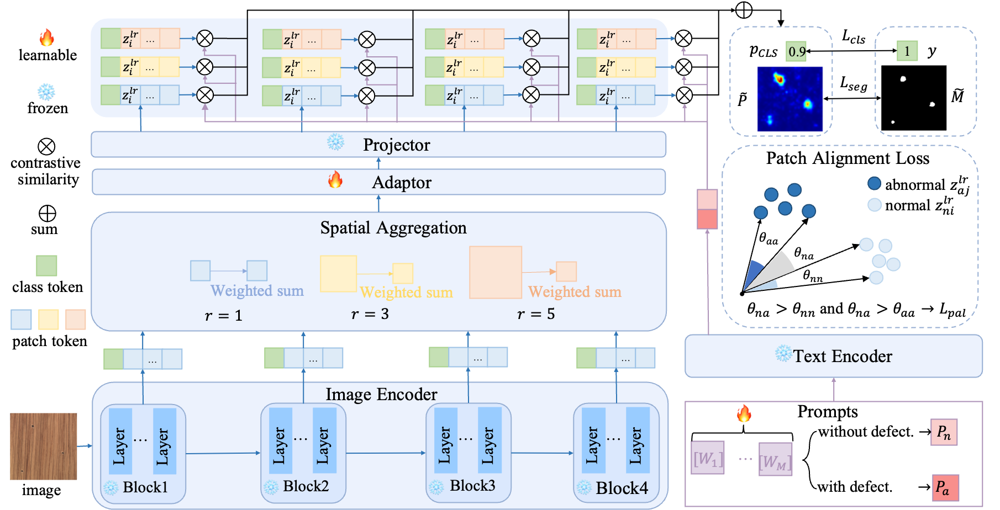

# Pytorch implementation of AF-CLIP

Pytorch implementation of Paper "AF-CLIP: Zero-Shot Anomaly Detection via Anomaly-Focused CLIP Adaptation"




please check you dataset dir is like below:
```
├── Br35H
├── Br35H
│   ├── no
│   └── yes
├── BrainMRI
│   ├── no
│   └── yes
├── btad
│   ├── 01
│   │   ├── ground_truth
│   │   │   └── ko
│   │   ├── test
│   │   │   ├── ko
│   │   │   └── ok
│   │   └── train
│   │       └── ok
│   ├── ...
├── CVC-ClinicDB
│   ├── images
│   └── masks
├── CVC-ColonDB
│   ├── images
│   └── masks
├── DAGM_KaggleUpload
│   ├── Class1
│   │   ├── Test
│   │   │   └── Label
│   │   └── Train
│   │       └── Label
│   ├── ...
├── DTD-Synthetic
│   ├── Blotchy_099
│   │   ├── ground_truth
│   │   │   └── bad
│   │   ├── test
│   │   │   ├── bad
│   │   │   └── good
│   │   └── train
│   │       └── good
│   ├── ...
├── ISIC2016
│   ├── ISBI2016_ISIC_Part1_Test_Data
│   └── ISBI2016_ISIC_Part1_Test_GroundTruth
├── Kvasir
│   ├── images
│   └── masks
├── mvtec
│   ├── bottle
│   │   ├── ground_truth
│   │   │   ├── broken_large
│   │   │   ├── broken_small
│   │   │   └── contamination
│   │   ├── test
│   │   │   ├── broken_large
│   │   │   ├── broken_small
│   │   │   ├── contamination
│   │   │   └── good
│   │   └── train
│   │       └── good
│   ├── ...
├── visa
│   ├── candle
│   │   └── Data
│   │       ├── Images
│   │       │   ├── Anomaly
│   │       │   └── Normal
│   │       └── Masks
│   │           └── Anomaly
│   ├── ...
│   ├── split_csv
```

Then change the data path `data_dir` in  `train.sh` or `test.sh` to train or test.

To train the zero-shot model, you can run
```
sh ./train.sh
```


To test model, you can run
```
sh ./test.sh
```
